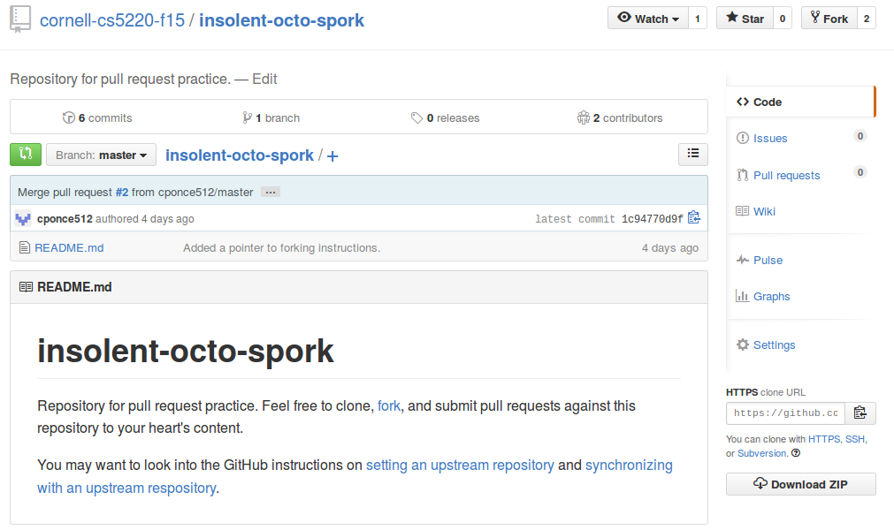
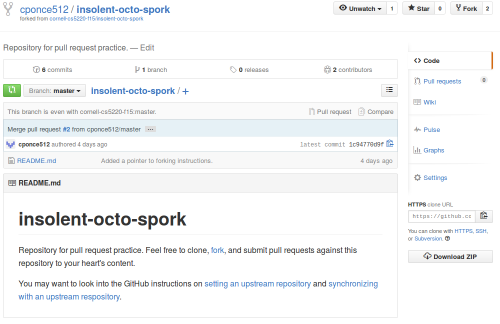

There were some questions in class yesterday on how to use git and GitHub. This
post will attempt to clarify that process. This is not a complete overview of
all possible functionality, just what you need to know for this class.

### What is git?

Git is software; in particular, it is a distributed revision control
system. That means that allows teams of people in different places to jointly
and asynchronously work on a common project. It supports creating local copies
of a locally hosted project, updating the remote project, merging updates that
different people have made, creating branches of projects, and more. It's
usually used for code, though one can certainly use it for other types of
projects!

### What is GitHub?

GitHub is a website and a hosting platform for git projects. You can remotely
store your projects on GitHub, and then access them with git.  GitHub also
provides extra functionality such as access control, project forking, and
discussion. GitHub is free, but all hosted repositories are public by
default. GitHub offers paid plans that allow a user to set repositories to
private.

## Some terms to know

**Fork.** This takes an existing repository that you may or may not own and
  creates a new copy that you own. This is a *GitHub* action, not a git action,
  and so the copy exists on GitHub, but not on your system. For that, you have
  to **clone** it.

**Clone.** (Command: `git clone [URL]`) This creates a local copy of a remote
  repository on your system.

**Pull.** (Command: `git pull`) This updates your local copy of a repository
  with any changes that have occurred at the remote repository. This only
  updates the repo associated with the directory that your terminal prompt is
  in, not every git repository on your machine.

**Add.** (Command: `git add [filename]`) Just because you created a new file on
  your machine in the same directory as your local copy of a repository doesn't
  mean it's in the git repository. You add the file the get git to track it.

**Commit.** (Command: `git commit -a -m "[message]"`) Just because you modified
  some files on your local repository doesn't mean git is tracking those
  changes. You commit those changes to record them. The -a flag commands git to
  record all changes to all tracked files. The -m flag precedes a written
  message describing the changes.

**Push.** (Command: `git push`) Just because you've locally added some files or
  recorded some changes doesn't mean those changes are reflected in the remote
  repository. You must push those changes to the remote repository. Note that
  you must have write permissions for your change to be accepted. Wanting to
  make changes to a project on which you lack write permissions is a common
  reason to **fork** a repository.

**Pull Request.** If you have pushed changes to a forked repository and want
  that change to be reflected in the original repository, you make a pull
  request. The owners of the original repository can then review the pull
  request and accept or reject it. This is a *GitHub* action, not a git
  action. Note that in this class, we will use pull requests as a mechanism for
  turning in assignments. We can access the contents of a pull request without
  accepting it, and so in that way access your submission.

## An insolent-octo-spork demonstration

You can access the [class GitHub page][2] through the [class website][3]. There
you can see a list of the various repositories we maintain for this class. We
will run through an example of using git and GitHub on the insolent-octo-spork
repository. You are encouraged to follow along and do the same on your
machine. Note that you need a GitHub account for this; if you don't already have
one, you should make one now.

Let's click on the link to insolent-octo-spork. This takes us to the repo
overview page for this repository. It should look something like what you see
below.

First, we want to create a copy of this repo that we can modify. To do that, we
click the **Fork** button in the upper right. The result will be a page that
looks like the image below. It looks similar to the one above, but note that the
name of the repo has been changed to
USERNAME/insolent-octo-spork. Congratulations, you have your very own
repository!

You now need to get the repo onto your local machine so you can work with it. In
the lower right of the above image, click on the box in the lower right labelled
"**HTTPS** clone URL" and copy the text inside to your clipboard. Then, in
terminal (or Cygwin) navigate to where you want to place the repository, type
`git clone` and then paste your clipboard. The result looks like

`git clone https://github.com/cponce512/insolent-octo-spork.git`

Run this command to **clone** the repository to the local machine.

Now, suppose this were a repository that other people could write to. If we
leave and come back later, other people might have made changes to the
repository. We want these changes reflected on our local machine. We can check
for such changes with the command

`git pull`

In our case, we just made this repo, so no changes have been made, and git tells
us that everything is already up-to-date.

Let's make some changes of our own. Open up README.md in a text editor, and make
some changes. I'm going to add a line at the beginning that says "This is an
update for testing repository pushes."

Now that we've made our changes to our local machine, we need to tell git to
track those changes locally. We can do that with the `git commit` command. I'm
going to type

`git commit -a -m "Updated README.md"'

The -a flag tells git to commit all changes in all files currently being tracked
for this repository. The -m flag precedes a written message in quotes in which
you [briefly describe the changes][1] in this commit. 

We then need to push these committed changes to the remote repository, which we
do with the command `git push`. You will be asked for your GitHub username and
password when doing this. *Note* in case you're not used to UNIX-style password
challenges: when typing your password you won't see any text onscreen, not even
*'s. That's normal, just keep typing!

Once this is done, you can see the changes on GitHub.

There is a message onscreen with the commit message you typed earlier. You can
also see the change reflected in the preview of README.md shown in your browser.

Now let's try adding a new file to the repository. I've created a new file in my
local repo directory called `new_file.md` and added a line of text. Git isn't
yet tracking this file so I need to call

`git add new_file.md`

to tell it to track. Once this is done, I again commit and push:

`git commit -a -m "Added a new file!"`

`git push`

The new file can now be seen in the repository.

Now that we've made some changes, suppose we want to see our changes reflected
in the upstream insolent-octo-spork repo from which we forked. We do this by
making a **pull request**. On the left of the screen in your browser, there is a
green button whose mouseoever text says "Compare, review, create a pull
request". Click it.

This brings you to a screen where you can choose options for the pull request
and see the changes you're proposing. Near the top is a drop-down menu for *base
fork.* This is the repository you want to update. The menu *head fork* is the
repository with the changes you want to see reflected in the base fork. The two
other drop-down menus let you select the base and head branches; this is
something we haven't discussed, so just leave it as master.

You probably don't need to make any changes on this page, so when you are ready
you can click the big green button that says "Create pull request." You will be
prompted to give the pull request a title, at which point you can click another
big green button that says "Create pull request" to actually submit the request.

Congratulations, you've made a pull request! You don't have the permissions to
accept the pull request, that belongs to the owners of the upstream repository
(in this case, the professor and the TA).

Pull requests track changes. This means that if you update your forked repo
(don't forget to commit and push!) those changes will be reflected in the pull
request.

*WARNING* If you are not the only one contributing to a repository, ALWAYS run
 `git pull` before starting to make any changes. If you don't, and someone has
 updated the remote repo, then your local copy of the repository will diverge
 from the remote repository. You will then have to go through a conflict
 resolution procedure to merge the two back together before you can push your
 changes.

### Summary of making changes

To summarize, making a change to a repository occurs in several steps:

* *Saving* a file records a file's changes to your local machine.
* *Committing* records those changes in git's local idea of your repository.
* *Pushing* makes those committed changes in the remote repository.
* A *pull request*, if accepted, makes those pushed changes in the upstream repository.

## Syncing with the upstream repository

Because you created a new repository when you forked, your repository is no
longer connected to the one from which you forked. This means that if someone
makes a change to the original, that change will not be reflected in your fork.

You can **sync** your fork to the original repository to reflect these
changes. The GitHub website has a fast and effective tutorial on doing this; see
[Fork a Repo][4] and [Syncing a Repo][5].

[1]: https://xkcd.com/1296/
[2]: https://github.com/cornell-cs5220-f15/
[3]: http://cornell-cs5220-f15.github.io/
[4]: https://help.github.com/articles/fork-a-repo/
[5]: https://help.github.com/articles/syncing-a-fork/